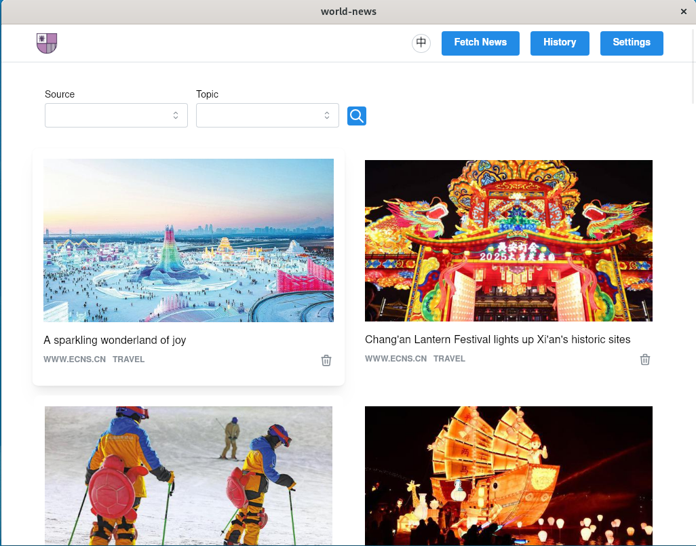

<p align="center"><a href="https://github.com/mjiee/world-news"></a></p>

<h1 align="center">World News</h1>

<p align="center">
  <a href="https://github.com/mjiee/world-news/releases"></a>
  <a href="https://github.com/wailsapp/wails"></a>
  <a href="https://go.dev"></a> 
  <a href="https://react.dev"></a>
  <a href="https://github.com/mjiee/world-news/blob/master/LICENSE"></a>
</p>

[中文说明](./doc/README.zh-CN.md)

Welcome to **World-News** — your one-stop desktop application for viewing global news from various sources. Whether you're looking to catch up on the latest headlines, explore different regions, or stay updated on specific topics, World-News makes it easy to access and read the most relevant stories from around the world.

## 🚀 Key Features

- Fetch the latest news in real-time from multiple global news sources.
- Offline reading support once the news is downloaded — read anytime, anywhere.
- Simple, intuitive user interface for seamless and convenient news browsing.
- Flexible data source configuration, allowing users to customize their news sources.
- Available for both desktop installation and web deployment, catering to different platform needs.

## 🖥️ User Interface

<p></p>

## ⚙️ Tech Stack

- **[Wails](https://wails.io/)** - Lightweight framework for building cross-platform desktop apps with Go and web technologies.
- **[React](https://react.dev/)** - JavaScript library for building user interfaces, used for creating the frontend.
- **[Mantine](https://mantine.dev/)** - A modern React component library for UI elements and hooks.
- **[Zustand](https://zustand-demo.pmnd.rs/)** - A minimalistic state management library for React, used to manage application state.
- **[Gin](https://gin-gonic.com/)** - Fast Go web framework for handling backend logic and API requests.
- **[Gorm](https://gorm.io/)** - ORM for Go, used to interact with databases.
- **[Zap](https://github.com/uber-go/zap)** - Structured, leveled logging library for Go, used for application logging.
- **[SQLite](https://www.sqlite.org/)** - Lightweight, serverless SQL database for local data storage.
- **[Colly](https://github.com/gocolly/colly)** - Fast and efficient web scraping library for Go.

## 🛠️ Installation & Setup

Ensure you have the following dependencies installed:

- **Go (>=1.23)**
- **Node.js (>=22)**

### 1. Clone the Repository

```bash
git clone https://github.com/mjiee/world-news.git
cd world-news
```

### 2. Build the Desktop App

To build and run the desktop version of the app, follow these steps:

```bash
# Build the app
make build
```

After building, you can run the application locally:

```bash
# On Linux/macOS
./build/bin/world-news

# On Windows
build\bin\world-news.exe
```

### 3. Backend Deployment \[Optional\]

The backend is built with Gin and serves as a web application for presenting news. You can deploy it in the following ways:

#### Docker Compose Deployment

Run the following command:

```bash
# Run the backend with Docker Compose
docker compose up -d
```

Access the app at http://localhost:9010 in your browser.

#### Local Deployment

Ensure you have a running PostgreSQL database locally and that the relevant database and user have been created.
Set up the database connection string:

```bash
WORLD_NEWS_DB_ADDR="host=localhost user=world_news password=world_news dbname=world_news port=5432 sslmode=disable"
```

Build and run the backend:

```bash
# Build the project
make build-web

# Run the backend service
./build/bin/world-news
```

Access the app at http://localhost:9010 in your browser.

#### Environment Variables

- **WORLD_NEWS_HOST**  
  _Description_: The host and port for the web service.  
  _Default_: `0.0.0.0:9010`.

- **WORLD_NEWS_DB_ADDR**  
  _Description_: The connection string for the database.

- **WORLD_NEWS_TOKEN**  
  _Description_: The token used for API authentication.  
  _Default_: `0123456`.

- **WORLD_NEWS_LOG_FILE**  
  _Description_: The file path for storing logs.

## ⚠️ Important Notes

- **Learning Project**: World-News is a learning project designed to explore Go, React, Wails, and other web technologies. It is not intended for production or commercial use.
- **Usage Restrictions**: Please avoid using this app for unethical activities or data scraping that violates news providers' terms of service. By using this application, you agree to refrain from misusing the data for illegal or unethical purposes.

## 🙋‍♂️ Contribution

Feel free to fork this repository and submit pull requests if you’d like to contribute! This is an open-source project, and contributions, improvements, and suggestions are always welcome.

## 📄 License

World-News is [MIT](LICENSE) licensed.
