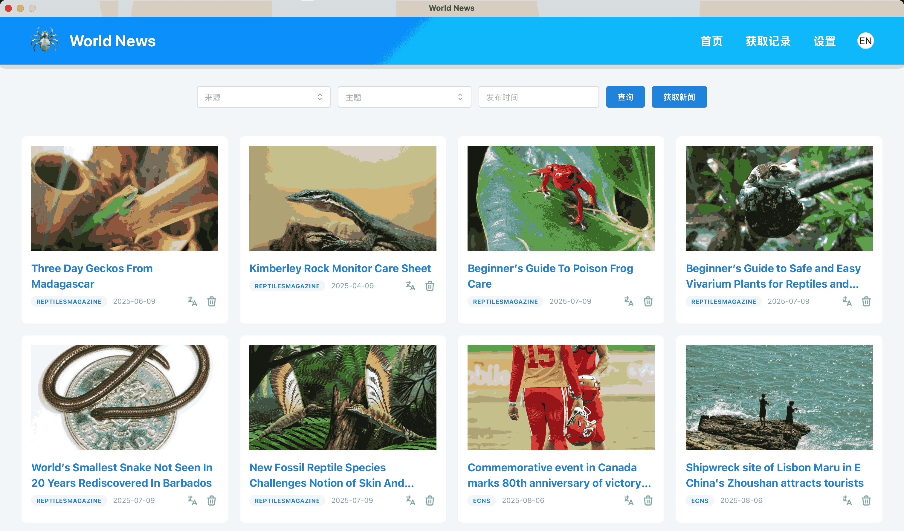

# World-News 🌍📰

欢迎使用 **World-News** —— 一款用于查看全球新闻的一站式桌面应用。无论你是想了解最新的新闻头条，或是探索不同地区的新闻，还是关注特定话题的新闻，World-News 都能让你轻松访问和阅读来自世界各地的最相关报道。

## 🚀 主要特性

- 实时获取全球多个新闻源的最新资讯，确保信息更新及时。
- AI 智能分析新闻，帮助您更深入理解重要内容。
- 支持自定义新闻来源，灵活配置数据源。
- 新闻下载后可离线阅读，随时随地轻松查看。
- 简洁直观的界面设计，带来流畅便捷的阅读体验。
- 兼容桌面安装与网页访问，满足不同平台的使用需求。

## 🖥️ 用户界面

<p></p>

## ⚙️ 技术栈

- **[Wails](https://wails.io/)** - 一个轻量级框架，用于使用 Go 和 Web 技术构建跨平台桌面应用。
- **[React](https://react.dev/)** - 用于构建用户界面的 JavaScript 库，应用于前端开发。
- **[Mantine](https://mantine.dev/)** - 现代化的 React 组件库，提供 UI 元素和 hooks。
- **[Zustand](https://zustand-demo.pmnd.rs/)** - 一个极简的 React 状态管理库，用于管理应用状态。
- **[Gin](https://gin-gonic.com/)** - 快速的 Go Web 框架，处理后端逻辑和 API 请求。
- **[Gorm](https://gorm.io/)** - Go 的 ORM，用于与数据库进行交互。
- **[Zap](https://github.com/uber-go/zap)** - 一个结构化、分级的 Go 日志库，用于应用日志记录。
- **[SQLite](https://www.sqlite.org/)** - 轻量级、无服务器的 SQL 数据库，用于本地数据存储。
- **[Colly](https://github.com/gocolly/colly)** - 一个 Go 的爬虫库，用于抓取网页内容。

## 🛠️ 安装与设置

确保你已安装以下依赖项：

- **Go (>=1.23)**
- **Node.js (>=22)**

### 1. 克隆仓库

```bash
git clone https://github.com/mjiee/world-news.git
cd world-news
```

### 2. 构建桌面应用

按照以下步骤构建并运行桌面版本的应用：

```bash
# 构建应用
make build
```

构建完成后，你可以本地运行应用：

```bash
# 在 Linux/macOS 上运行
./build/bin/world-news

# 在 Windows 上运行
build\bin\world-news.exe
```

### 3. 后端部署【可选】

后端使用 Gin 构建，提供 Web 端访问界面。你可以通过以下方式部署后端：

#### 使用 Docker Compose 部署

运行以下命令：

```bash
# 使用 Docker Compose 启动后端
docker compose up -d
```

然后，在浏览器中访问 http://localhost:9010。

#### 本地部署

确保本地有运行中的 PostgreSQL 数据库，并创建了相关 database 和 user。设置数据库连接字符串：

```bash
WORLD_NEWS_DB_ADDR="host=localhost port=5432 user=world_news password=world_news dbname=world_news sslmode=disable TimeZone=Asia/Shanghai"
```

构建并运行后端：

```bash
# 构建项目
make build-web

# 运行后端服务
./build/bin/world-news
```

然后，在浏览器中访问 http://localhost:9010。

#### 环境变量

- **WORLD_NEWS_HOST**  
  _描述_: 服务监听地址和端口。  
  _默认值_: `0.0.0.0:9010`.

- **WORLD_NEWS_DB_ADDR**  
  _描述_: 数据库连接字符串。

- **WORLD_NEWS_TOKEN**  
  _描述_: API 认证使用的 token。
  _默认值_: `0123456`.

- **WORLD_NEWS_LOG_FILE**  
  _描述_: 日志文件路径。

## ⚠️ 重要提示

- **学习项目**: World-News 是一个学习项目，旨在探索 Go、React、Wails 和其他 Web 技术。它不适用于生产或商业用途。
- **使用限制**: 请避免将本应用用于不道德活动或违反新闻提供商服务条款的数据抓取。使用本应用即表示你同意不将获取的数据用于非法或不道德的用途。

## 🙋‍♂️ 贡献

如果你希望贡献代码，欢迎 fork 该仓库并提交 pull request！这是一个开源项目，欢迎任何改进或建议。

## 📄 许可证

World-News 使用 [MIT](LICENSE) 许可证。
